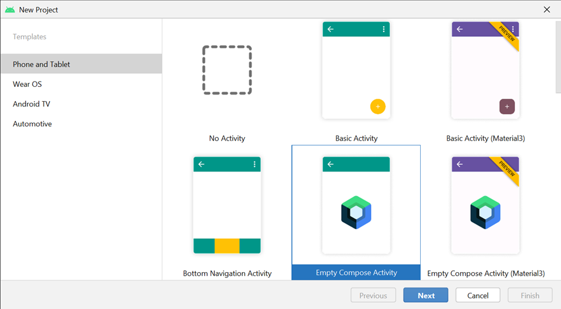

# A basic UI with Compose

## Overview
This is your first exercise. 
You will do a hands-on practice of creating and 
running a simple project in Android Studio using Jetpack Compose.

## Scenario
You want to create the Little Lemon app and start developing the UI. 
The first step is to become familiar with Android Studio and 
exercise writing and using your own composable function.

## Instructions
Open up Android Studio.

### Step 1: Create a new project using Compose
Create a new project by selecting "Empty Compose Activity" from the "New Project" dialog.
Name the project "Little Lemon Exercise".

### Step 2: Define a string resource
Open the `strings.xml` file and define a new string resource, 
just like the already defined `app_name` string. 
Note that the `strings.xml` file is located under the app -> res -> values folder.

The name of the new string resource should be "title" and the string should be "Little Lemon".

### Step 3: Define a new composable
Define a new composable function `RestaurantName()`, 
just like the `Greetings()` composable already defined in the generated code.
It should also take a string "name" as an argument.

Similar to `Greetings()`, 
`RestaurantName()` should call a built-in Text composable in its body.

The string argument "name" passed to `RestaurantName()` should in turn be displayed by the Text.

### Step 4: Call the new composable
Within `setContent` block of the MainActivity, 
replace the call to `Greetings()` with a call to `RestaurantName()`. 
This function should be passed a String argument.
Instead of passing the "Little Lemon" string literal,
as it was in case of pre-defined `Greetings()` function,
you are going to use the string resource defined in Step 2.

### Step 5: Set the text of the new composable to string resource
To load the string resource and get the new string,
call the `stringResource()` function and 
pass the ID of the string you defined as an argument.

💡 Hint: The ID of the newly defined string resource would be `R.string.title`.

### Step 6: Define the preview
To view the output of your composables, 
it is convenient to define the preview functions. 
Therefore, you should define the `RestaurantNamePreview()`, 
similar to the `DefaultPreview()` function auto-generated by Android Studio.

💡 Hint: The preview function definition starts with the `@Preview` annotation, followed by `@Composable`.

### Step 7: Open preview

To view the preview, click on the Split button. 
Note that before rendering the preview, 
Android Studio may take a little bit of time to build the app.

### Step 8: Define the argument for font size

Since "Little Lemon" is going to be the title text in the app,
the font size has to be bigger than the normal size.
Instead of "hard coding" the font size value,
your composable should be able to accept the font size as an argument.

To be able to change the font size,
define a second parameter in `RestaurantName()` composable.
The parameter name should be "size" and the type should be `Int`.

Inside `RestaurantName()` definition,
the "size" should be set to the fontSize property of the Text composable.

💡 Hint: the font size units should be defined in `sp`

### Step 9: Update the calls to the composable

Before you run the app,
make sure to pass two arguments to `RestaurantName()` function calls.
The first argument is the string from the string resource,
while the second argument should be an integer 32 representing font size.

💡 Hint: There are two calls to `RestaurantName()`,
   inside the `setContent` and the preview function.

### Step 10: Run the app

Finally, run the app in the emulator.
The output should contain the "Little Lemon" text on the top left corner of the screen with a bigger than normal font (size 32sp).

## Conclusion
By completing this exercise, you practiced:
- Creating a Compose project in Android Studio.
- Defining a new composable with parameters.
- Defining a preview function.
