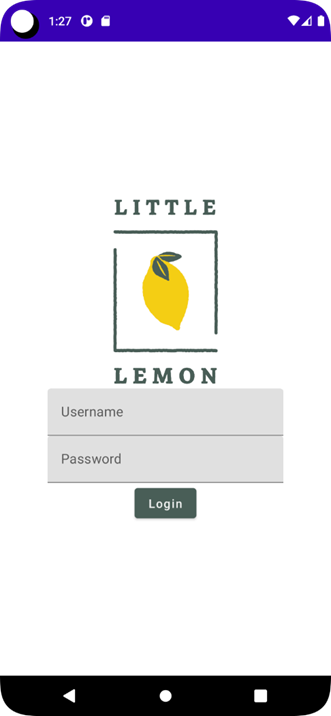

# Exercise: Defining login screen with Compose

## Overview
In this exercise, you will build a simple login screen in Android Studio using Jetpack Compose.

You are not expected to build a completely functional login app. 
You will not be able to input in the text fields and 
the login button will not verify username and the password. 
Rather, the purpose here is to exercise laying out multiple composable and 
build a nice presentable UI.

## Scenario
While progressing in your development for the Little Lemon app UI, 
you are tasked to build a login screen. 
You have learned about some built-in composable and basic layouts, 
and have become familiar with Android Studio. 
It is the right time for you to test your understanding with this interesting task.

## Instructions
Follow the steps below to complete the exercise.

### Step 1: Prepare the project
Once you have Android Studio ready and the project is built, 
follow the steps below to set up the project before you start the exercise.

### Step 2: Define composable for the login screen

There will be several UI elements or composable in the login screen. 
You should make a top-level composable that will contain the logo image, login fields, and the button.

Therefore, define a new composable for the login screen and name it `LoginScreen`.

Place a call to `LoginScreen` composable inside setContent.

### Step 3: Define the layout for the login screen

Before you add any element, you can guess that those should appear vertically. 
Define a layout in the `LoginScreen` that will support that.

### Step 4: Center the layout content

The UI elements inside the layout should be centered, both vertically and horizontally.

Define layout properties to ensure that.

### Step 5: Add an image to the login screen
The first element to add is an image. 
Add an Image composable.

The painter property should be set using the `painterResource` function call. 
This function should be provided the id of the logo image drawable.

The `contentDescription` property should be set to "Logo Image".

💡 Note: The logo image should be added to the drawable resource. 
Refer to the Setup section to see how to add the image to drawable folder.

### Step 6: Add a text field for the username
Below the logo image, add a text field to the login screen.

You should use the `TextField` built-in composable.
The value and `onValueChange` properties should be set to empty string and empty block respectively.

You must define the `label` property for this text field. 
The label lambda should be a composable. 
So you should use simple `Text` composable and set its text to "Username".

### Step 7: Define a preview function for the login screen
To view what the login screen looks like up to this point, 
define a preview function for the login screen. 
Name it `LoginScreenPreview()`.

Open the preview to make sure you have the logo image and the username text field below it, 
both centered in the screen.

### Step 8: Add a text field for password
Next, just like the username text field added in Step 5, 
add a password text field to the login screen. 
However, make sure that the field label is set to "Password".

### Step 9: Add a login button
Finally, add a button to the screen. 
The button text should read "Login".

You should also set the button background color and 
the text color in line with the color scheme defined in the Little Lemon Style Guide.

For the button background color, use the color hex value `#495E57`.

For the button text color, use the color hex value `#EDEFEE`.

### Step 10: Run the app
Finally, run the app in the emulator.

The output should contain the logo image, 
the two text fields for the username and password, and the login button, all centered on the screen.

## Conclusion
By completing this exercise, 
you demonstrated defining a login screen using a simple layout and 
built-in composable with simple styling.