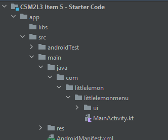

# Exercise: Building a responsive layout

## Overview
So far, you’ve learned about the scaffold, scaffold state and the material components. 
In this activity, you’ll practice using the scaffold state 
to persist the view state across device orientation changes. 
By the time you complete this activity, 
you will be able to update the user interface in response to the user rotating their phone. 
This will help you develop apps that are responsive to rotation 
in your career as an Android developer.

## Scenario
Little Lemon has just completed setting up the menu screen of their app.
However, their app was only designed for a portrait layout.
When the user rotates their phone, this layout doesn't look great.
You’ve been asked to implement a grid layout that is presented
when the phone is rotated to a landscape position.

## Definition of key topic
To practice presenting different layouts on orientation changes, 
you’ll update an existing app by checking the current orientation and 
providing a different layout for portrait and landscape views.

## Instructions

### Step 1: Access the orientation

1. In the `MenuContent` composable function in `MainActivity.kt`, 
   create a new variable named `configuration` and
   assign it the value of `LocalConfiguration.current`.
2. To find out what the current orientation is,
   use the `orientation` property of the `configuration` variable.
3. Add a `when` statement that uses the orientation.
   The two cases inside the `when` statement will be `ORIENTATION_LANDSCAPE` and the `else` case.

### Step 2: Update the layout
1. Move the current single-column layout into the else case of the layout.
2. In the `ORIENTATION_LANDSCAPE` case, add a `Column` with two `Row` elements.
3. Copy two of the `Text` elements to the first `Row` element.
4. Copy the other two `Text` elements to the second `Row` element.

### Step 3: Run the application
1. Run the app in the emulator on the device.
2. Rotate the device from portrait mode to landscape mode and note the updated layout.

> 💡 Tip: Ensure that the orientation lock is not enabled on the device

## Conclusion
By completing this exercise,
you demonstrated your ability to present different layouts to the user based on the orientation of their device. 
Handling orientation changes is important in modern apps 
because it lets you optimize your app to the space you have on screen.
This skill will prove helpful when developing apps in your career as an Android developer.