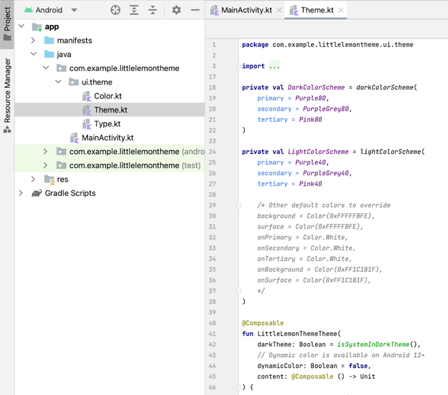

# Exercise: Defining resources and themes
The Text Composable provides a set of attributes that allow you to style the text.

## Overview
You have previously learned why you use resources
and themes and how to define them. 
In this exercise, you will practice how to define
and use resources and themes in a real-life scenario.

## Scenario
In this scenario, you need to configure a theme in the Little Lemon app.
You're required to set up colors and use these colors in the app's Theme.

## Definition of Key Topic
To practice using themes, you will create a new Android project in Android Studio.
Then, you will define modify application colors by adding a custom Color 
and using these colors in the application theme. 
Finally, you will create the "Order" button that will use the newly added color.

## Instructions

### Step 1: Define Color
Follow the steps below to create a new project in Android Studio.
1. Select "File" from the top menu.
2. Select "New Project".
3. Select "Empty Compose Activity".
4. Click "Next".
5. Enter "Little Lemon Theme".
6. Click Finish.

Open the `Theme.kt` file in the `com.example.littlelemontheme.ui.theme` package
and set the following in the `LittleLemonTheme` function:

```kotlin
dynamicColor: Boolean = false
```



### Step 2: Define Color
Modify the `Color.kt` file containing a “yellow” color value of 0xFFF4CE14.

### Step 3: Use Color
Set the yellow color as the primary theme color for the light color scheme.

### Step 4: Create UI
Add the Button with the “Order” text to the `MainActivity`.

## Conclusion
In this exercise, you practiced how to define and use resources 
and themes in a real-life scenario that you can apply in your Little Lemon app.